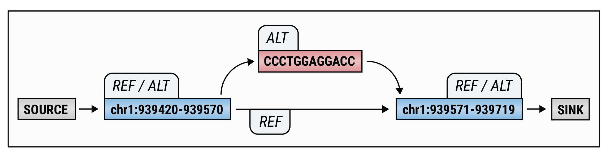
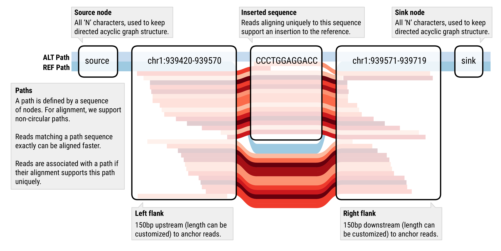

# ParaGRAPH: a suite of graph-based genotyping tools

<!-- vscode-markdown-toc -->
* [Introduction](#Introduction)
* [Quick Start](#QuickStart)
* [System Requirements](#SystemRequirements)
	* [Hardware](#Hardware)
	* [Operating systems](#Operatingsystems)
	* [Helper scripts](#Helperscripts)
	* [Library Dependencies](#LibraryDependencies)
* [Installation](#Installation)
* [Using helper scripts to run paraGRAPH](#UsinghelperscriptstorunparaGRAPH)
* [Using vcf2paragraph.py to run paraGRAPH](#Usingvcf2paragraph.pytorunparaGRAPH)
* [Further Information](#FurtherInformation)
	* [Documentation](#Documentation)
	* [Links](#Links)
* [License](#License)

<!-- vscode-markdown-toc-config
	numbering=false
	autoSave=true
	/vscode-markdown-toc-config -->
<!-- /vscode-markdown-toc -->

## <a name='Introduction'></a>Introduction

Accurate genotyping of known variants is a critical component of clinical-grade
pipelines for analysis of whole-genome sequencing data. It enables us to

- test a sample for presence of specific pathogenic variants,
- evaluate newly discovered variants,
- compute background genotype distributions in different populations.

ParaGRAPH aims to facilitate these tasks by providing an accurate genotyper
for known deletions, insertions, and substitutions. It can be applied to either
a single sample or to a large cohort consisting of hundreds and even thousands
of samples.

In addition to providing genotyping for deletion / insertion / substitution events,
ParaGRAPH provides a suite of graph-based tools to enable joint alignment and genotyping
for other event types. In a typical workflow, we can use these tools to

   * construct a graph that represents variant alleles,
   * align reads from one or many BAM files to the graph,
   * use read counts on nodes and edges to re-genotype the variant.

In future releases we will add support for genotyping more variant types using
ready-made workflows.

Paragraph is under active development -- if you have any questions or find
bugs, please don't hesitate to contact us by creating Github issues for this
project!

## <a name='QuickStart'></a>Quick Start

After [installing](#Installation) the tool, we can try and run a small test
dataset we have included to see if everything is working as expected.

Let's assume ParaGRAPH is installed as follows:

```bash
$ export PARAGRAPH=~/paragraph-install
```
The directory will contain the following files (and a few more):
```
├── bin                     # binaries
│   ├── multigrmpy.py   # Graph genotyping wrappers
│   ├── multiparagraph.py
│   ├── ...
│   ├── paragraph           # graph aligner
│   ├── grmpy               # graph aligner and genotyper (single site)
│   ├── idxdepth            # BAM/CRAM depth estimator
│   ├── kmerstats           # kmer statistics tool for graphs
│   ├── ...
│   ├── findgrm.py          # helpers and conversion scripts
│   ├── compare_alignments.py
│   ├── merge_paragraph_json.py
│   ├── msa2vcf.py          # convert multiple-alignment FASTA files to VCF
│   ├── paragraph2dot.py    # converts paragraph JSON graphs to DOT (graphviz)
│   └── vcf2paragraph.py    # converts VCF files to paragraph JSON
├── lib                     # python libraries
└── share                   # test and example data
    ├── analysis
    ├── examples
    ├── getting-started
    ├── paragraph_output_examples
    ├── schema
    └── test-data
```

For most small-scale applications, the entry point is the `multigrmpy.py` script:

```bash
$ ${PARAGRAPH}/bin/multigrmpy.py
usage: multigrmpy.py [-h] -i INPUT -o OUTPUT -m MANIFEST -r REFERENCE

multigrmpy.py: error: the following arguments are required: -i/--input, -o/--out, -m/--manifest, -r/--reference-sequence
```

This script implements a workflow to genotype variants on one or more
samples. It minimally requires three inputs:

* a reference FASTA file,
* a candidate file of variants, which can be in JSON or VCF format,
* a manifest / list of BAM files and their statistics.

The output is a directory, here we use `/tmp/paragraph-test` (before re-running with the same
output path you may want to delete this directory).

```bash
$ ${PARAGRAPH}/bin/multigrmpy.py \
    -r ${PARAGRAPH}/share/test-data/genotyping_test_2/swaps.fa \
    -i ${PARAGRAPH}/share/test-data/genotyping_test_2/swaps.vcf \
    -m ${PARAGRAPH}/share/test-data/genotyping_test_2/samples.txt \
    -o /tmp/paragraph-test
$ tree /tmp/paragraph-test
```

```
/tmp/paragraph-test
├── grmpy.log
├── genotypes.json.gz  # genotypes and additional information for our one sample
├── genotypes.vcf.gz   # genotypes in VCF format (only when input was also VCF)
└── variants.json.gz  # full variant graphs, converted from swaps.vcf
```

The first file to look at is the file `grmpy.log`:

```
[2018-05-30 19:08:01.057] [Genotyping] [11589850564992724888] [critical] Starting alignment for sample SWAPS (1/1)
[2018-05-30 19:08:01.058] [Genotyping] [13762672856748146659] [critical] Starting alignment for sample SWAPS (1/1)
[2018-05-30 19:08:01.058] [Genotyping] [14316483420521963862] [critical] Starting alignment for sample SWAPS (1/1)
[2018-05-30 19:08:01.059] [Genotyping] [17003373142924278091] [critical] Starting alignment for sample SWAPS (1/1)
[2018-05-30 19:08:01.059] [Genotyping] [9576328718556000728] [critical] Starting alignment for sample SWAPS (1/1)
[2018-05-30 19:08:01.059] [Genotyping] [14181681436824356172] [critical] Starting alignment for sample SWAPS (1/1)
[2018-05-30 19:08:01.060] [Genotyping] [4886869389785116662] [critical] Starting alignment for sample SWAPS (1/1)
[2018-05-30 19:08:01.060] [Genotyping] [6672028834885690059] [critical] Starting alignment for sample SWAPS (1/1)
[2018-05-30 19:08:09.431] [Genotyping] [11589850564992724888] [critical] Sample SWAPS: Alignment 1 / 3 finished
[2018-05-30 19:08:09.569] [Genotyping] [13762672856748146659] [critical] Sample SWAPS: Alignment 2 / 3 finished
[2018-05-30 19:08:09.758] [Genotyping] [14316483420521963862] [critical] Sample SWAPS: Alignment 3 / 3 finished
[2018-05-30 19:08:09.760] [Genotyping] [6672028834885690059] [critical] Genotyping finished for graph 2 / 3
[2018-05-30 19:08:09.760] [Genotyping] [11589850564992724888] [critical] Genotyping finished for graph 1 / 3
[2018-05-30 19:08:09.760] [Genotyping] [14181681436824356172] [critical] Genotyping finished for graph 3 / 3
```

If everything worked well, the genotypes JSON file will give the graph used
for each candidate variant as well as genotypes and Hardy-Weinberg p-values
for each sample.

In the example above, we have genotyped three events. The BAM files were constructed
to give the following genotypes for each event:

| **Event** |  **Chromosome** |  **Genotype**         |
|:---------:|:---------------:|:---------------------:|
| swap1     |  chrA           | REF/REF (homref)      |
| swap2     |  chrB           | S1/S1 (homalt)        |
| swap1     |  chrC           | REF/S1 (heterozygous) |

We can extract these genotypes from the output file using Python script at bin/paragraph-to-csv.py

```
bin/paragraph-to-csv.py /tmp/paragraph-test/genotype.json.gz --genotype-only
```

The output will be:

```
#FORMAT=GT
#ID SWAPS
chrA:1500-1509  REF/REF
chrB:1500-1509  S1/S1
chrC:1500-1699  REF/S1
```

The output JSON file contains more information which can be used to link
events back to the original VCF file, genotype likelihoods, and also to get the
genotypes of the individual breakpoints.

If the input is a VCF file, then the output folder will contain an updated
VCF file which allows us to quickly compare the original genotypes from the
input VCF, and those obtained by grmpy:

```
bcftools query -f '[%GT\t%OLD_GT]\n' /tmp/paragraph-test/genotypes.vcf.gz
```
```
0/0     0/0
1/1     1/1
0/1     0/1
```

We can see that the genotypes match in our use case, as expected.

In [doc/multiple-samples.md](doc/multiple-samples.md), we show how ParaGRAPH can be run on multiple samples with snakemake.
[Doc/genotyping-parameters.md](doc/genotyping-parameters.md) contains
additional information on how to adjust parameters for genotyping and variant
filtering.

## <a name='SystemRequirements'></a>System Requirements

### <a name='Hardware'></a>Hardware

A standard workstation with at least 8GB of RAM should be sufficient for compilation and testing of the program. The
system requirements for running the actual data analysis depend on the number of
input variants and samples. It typically takes up to a few seconds to genotype a single event in one sample. We provide
wrapper scripts to parallelize this process. We have genotyped hundreds of thousands of variants in a single
sample in around 2-3 hours using 40 CPU cores.

### <a name='Operatingsystems'></a>Operating systems

ParaGRAPH must be compiled with g++ version 4.9.x or later, or with a recent version of Clang.
We use the C++11 standard, any Posix compliant compiler supporting this standard
should be usable. We have tested using g++ and Clang on the following systems:

- Ubuntu 16.04 and CentOS 5-7,
- macOS 10.11+,
- Windows is not supported currently.

### <a name='Helperscripts'></a>Helper scripts

All helper, wrappers, and conversion scripts are implemented in Python 3.6 (see
[graph-tools.md](doc/graph-tools.md)). The following third-party packages are required:

- Pysam (MIT license; https://github.com/pysam-developers/pysam),
- Intervaltree (Apache 2.0 license; https://pypi.python.org/pypi/intervaltree),
- Jsonschema (MIT license; https://pypi.python.org/pypi/jsonschema).

The complete list of requrements can be found in [requirements.txt](requirements.txt).

### <a name='LibraryDependencies'></a>Library Dependencies

- [Boost libraries](http://www.boost.org) version >= 1.5 is required. Boost can be obtained from
  [http://www.boost.org](http://www.boost.org) and is available under the Boost license:
  [http://www.boost.org/users/license.html](http://www.boost.org/users/license.html).

  You may use your system Boost version, on Ubuntu, you can install the required versions
  of Boost as follows:
  ```bash
  sudo apt install libboost-dev libboost-iostreams-dev libboost-program-options-dev \
                   libboost-math-dev libboost-system-dev libboost-filesystem-dev
  ```

  Paragraph includes a copy of Boost 1.61 which can be built automatically during the
  configuration process. If you prefer to use this over your system's version you can
  use the `-DUSE_SYSTEM_BOOST=FALSE` cmake option.

  If you have a different Boost version you have precompiled, please follow the instructions below.
  For versions of Boost that are not installed system-wide, we prefer to statically link Boost libraries
  to Paragraph executables.
  This requires that static Boost libraries are generated which can be achived as follows:

  ```bash
  cd ~
  wget http://downloads.sourceforge.net/project/boost/boost/1.65.0/boost_1_65_0.tar.bz2
  tar xf boost_1_65_0.tar.bz2
  cd boost_1_65_0
  ./bootstrap.sh
  ./b2 --prefix=$HOME/boost_1_65_0_install link=static install
  ```

  To point Cmake to your version of Boost use the `BOOST_ROOT` environment variable:

  ```bash
  export BOOST_ROOT=$HOME/boost_1_65_0_install
  # Now run cmake + build -- note you may have to erase your cache + build folder
  # for the new settings to become active.
  ```

- Recent versions of Google Test and Google Mock are required.

  Copyright: 2008, Google Inc., see
  [https://github.com/google/googletest/blob/master/googletest/LICENSE](https://github.com/google/googletest/blob/master/googletest/LICENSE)
  and
  [https://github.com/google/googletest/blob/master/googlemock/LICENSE](https://github.com/google/googletest/blob/master/googlemock/LICENSE).

  This repository includes copy of Google Test/Mock is ([external/googletest-release-1.8.0.tar.gz](external/googletest-release-1.8.0.tar.gz)).
  It will be built automatically during the configuration stage of the Cmake build process.

  See also the LICENSE files contained in [external/googletest-release-1.8.0.tar.gz](external/googletest-release-1.8.0.tar.gz).

- Htslib is required. We include a copy of Htslib from
  [https://github.com/samtools/htslib](https://github.com/samtools/htslib). Htslib is released under MIT license, copyright (C) 2012-2014 Genome Research Ltd.

  The version of htslib we use is picked up from [external/htslib.tar.gz](external/htslib.tar.gz) and will be deployed
  in the build folder in `scratch/htslib` (see [external/make_dependencies.sh](external/make_dependencies.sh)).

- Spdlog is required and included in the source tree. Spdlog is a header-only logging library from https://github.com/gabime/spdlog (MIT license,
  Copyright (c) 2016 Gabi Melman., see
  [https://github.com/gabime/spdlog/blob/master/LICENSE](https://github.com/gabime/spdlog/blob/master/LICENSE)
  and the LICENSE file in [external/spdlog.tar.gz](external/spdlog.tar.gz)).

  The library will be deployed during the cmake configuration process. It can be found in the build folder in
  `scratch/spdlog` (see [external/make_dependencies.sh](external/make_dependencies.sh)).

- A list of other included libraries can be found in the [LICENSE](LICENSE) file.

## <a name='Installation'></a>Installation

- **Native Build**. First, checkout the repository like so:

  ```bash
  git clone https://github.com/Illumina/paragraph.git
  cd paragraph-tools
  ```

  Then create a new directory for the program and compile it there:

  ```bash
  # Create a separate build folder.
  cd ..
  mkdir paragraph-tools-build
  cd paragraph-tools-build

  # Configure
  # optional:
  # export BOOST_ROOT=<path-to-boost-installation>
  cmake ../paragraph-tools

  # Make, use -j <n> to use n parallel jobs to build, e.g. make -j4
  make
  ```

- **Docker** We also provide a [Dockerfile](Dockerfile). To build a Docker image, run the following command inside the source
  checkout folder:

  ```bash
  docker build .
  ```

  Once the image is built you can find out its ID like this:

  ```bash
  docker images
  ```
  ```
  REPOSITORY                             TAG                 IMAGE ID            CREATED             VIRTUAL SIZE
  <none>                                 <none>              259aa8c0c920        10 minutes ago      2.18 GB
  ```

  The default entry point is the `multigrmpy.py` script:

  ```bash
  sudo docker run -v `pwd`:/data 259aa8c0c920
  usage: multigrmpy.py [-h] -i INPUT -o OUTPUT -b BAM -r REF [-p READ_LEN]
                           [-l MAX_REF_NODE_LEN]
                           [--log LOG]
  ```

  The current directory can be accessed as `/data` inside the Docker container, see also
  [https://docs.docker.com/engine/reference/commandline/run/](https://docs.docker.com/engine/reference/commandline/run/).

  To override the default entrypoint run the following command to get an interactive shell in which the paragraph tools
  can be run:

  ```bash
  sudo docker run --entrypoint /bin/bash -it 259aa8c0c920
  ```

## <a name='UsinghelperscriptstorunparaGRAPH'></a>Using helper scripts to run paraGRAPH

After this, you can run the `multigrmpy.py` script from the build/bin directory on an example dataset as follows:

```bash
python3 bin/multigrmpy.py -i share/test-data/round-trip-genotyping/candidates.json \
                              -m share/test-data/round-trip-genotyping/samples.txt \
                              -r share/test-data/round-trip-genotyping/dummy.fa \
                              -o test \
```

This runs a simple genotyping example for two test samples. The input files are as follows:

*  **candidates.json**: this specifies some candidate SV events.
   ```json
    [
      {
        "ID": "test-ins",
        "chrom": "chr1",
        "start": 161,
        "end": 162,
        "ins": "TGGGGGG"
      },
      {
        "ID": "test-del",
        "chrom": "chr1",
        "start": 161,
        "end": 163,
        "ins": ""
      }
    ]
   ```

Alternatively, candidate SV events can be specified as vcf.
*  **candidates.vcf**: this specifies candidate SV events in a vcf format.
   ```
    ##fileformat=VCFv4.2
    ##FILTER=<ID=PASS,Description="All filters passed">
    ##ALT=<ID=DEL,Description="Deletion">
    #CHROM	POS	ID	REF	ALT	QUAL	FILTER	INFO
    chr1	161	test-ins	T	TGGGGGG	.	.	.
    chr1	161	test-del	TC	T	.	.	.
   ```

*  **samples.txt**: Manifest that specifies some test BAM files. Required columns: ID, path, depth, read length. Optional column: sex. Tab delimited.
    ```
    id path    depth   read length  sex
    sample1	sample1.bam 1   50  male
    sample2	sample2.bam 1   50  female
    sample3	sample2.bam 1   50  unknown
    ```

*  **dummy.fa** a short dummy reference which only contains `chr1`

The output folder `test` then contains gzipped json for final genotypes:

```bash
$ tree test
```
```
test
├── GraphTyping.log      #  main workflow log file
├── variants.json        #  Json formatted candidate variant graphs. Only exist if input is a VCF.
└── genotype.json.gz     #  genotyping result
```

## <a name='Usingvcf2paragraph.pytorunparaGRAPH'></a>Using vcf2paragraph.py to run paraGRAPH

Consider an insertion specified by the following VCF record:

```
#CHROM   POS      ID    REF   ALT              QUAL    FILTER    INFO    FORMAT    ALT
chr1     939570   .     T     TCCCTGGAGGACC    0       PASS      .       GT        1
```


We can construct a sequence graph that corresponds to this insertion (this uses
the `vcf2paragraph.py` and `paragraph2dot.py` scripts provided with this package,
and a hg38 reference sequence which can be obtained from
[http://hgdownload.cse.ucsc.edu/goldenPath/hg38/bigZips](http://hgdownload.cse.ucsc.edu/goldenPath/hg38/bigZips/)).
The `vcf2paragraph.py` script supports a subset of the VCF file format which is documented in
[doc/graph-tools.md](doc/graph-tools.md#vcf2paragraph.py).

```bash
python3 vcf2paragraph.py share/test-data/paragraph/pg-het-ins/pg-het-ins.vcf pg-het-ins.json -r hg38.fa
# visualize using dot / graphviz, see http://www.graphviz.org/
python3 paragraph2dot.py pg-het-ins.json pg-het-ins.dot
dot -Tpng pg-het-ins.dot > pg-het-ins.png
```

The resulting graph has the following structure:



Nodes and edges may be labelled using sequence tags such as `REF` and
`ALT`. These induce paths in our sequence graph and identify the different alleles
we would like to genotype.

The JSON File [pg-het-ins.json](share/test-data/paragraph/pg-het-ins/pg-het-ins.json) contains
a description of the sequence graph derived from the input VCF file. We can align reads to this
graph using that `paragraph` tool as follows:

```bash
paragraph -r hg38.fa -g pg-het-ins.json -b share/test-data/paragraph/pg-het-ins/na12878.bam \
          -o pg-het-ins-readcounts.json
```

The resulting JSON file gives read counts and alignments (part of this figure was
created using a modified version of SequenceTubeMap -- see https://github.com/vgteam/sequenceTubeMap):



For editing / manual inspection, it is typically a good idea to pretty-print the file:

```bash
python -mjson.tool pg-het-ins-readcounts.json > pg-het-ins-readcounts.pretty.json
```

The resulting file contains the original graph in JSON format (see [pg-het-ins.json](share/test-data/paragraph/pg-het-ins/pg-het-ins.json))

```javascript
{
    "sequencenames": [ "ALT", "REF" ],
    "nodes": [
        {
            "name": "source",
            "sequence": "NNNNNNNNNN"
        },
        // ...
    ],
    "edges": [
        {
            "from": "939571-939570:CCCTGGAGGACC",
            "to": "ref-chr1:939571-939719"
        },
        // ...
    ],
    "target_regions": [ "chr1:939420-939719" ],
```

We also have the paths induced by the edge labels (this was added by `vcf2paragraph.py`):

```javascript
    "paths": [
        {
            "nodes": [ "source", "ref-chr1:939420-939570", "939571-939570:CCCTGGAGGACC", "ref-chr1:939571-939719", "sink" ],
            "nucleotide_length": 312,
            "path_id": "ALT|1",
            "sequence": "ALT"
        },
        {
            "nodes": [ "source", "ref-chr1:939420-939570", "ref-chr1:939571-939719", "sink" ],
            "nucleotide_length": 300,
            "path_id": "REF|1",
            "sequence": "REF"
        }
    ],
```

Each node, edge, and path has reads associated with it. We provide read counts for forward
and reverse strands (`:READS`, `:FWD`, `:REV`) and fragment counts (these counts are corrected
for the same reads possibly originating from the same sequence fragment in the case of
paired-end sequencing data).

```javascript
    "read_counts_by_edge": {
        "939571-939570:CCCTGGAGGACC_ref-chr1:939571-939719": 15,
        "939571-939570:CCCTGGAGGACC_ref-chr1:939571-939719:FWD": 6,
        "939571-939570:CCCTGGAGGACC_ref-chr1:939571-939719:READS": 15,
        "939571-939570:CCCTGGAGGACC_ref-chr1:939571-939719:REV": 9,
        "ref-chr1:939420-939570_939571-939570:CCCTGGAGGACC": 14,
        // ...
        "total": 29,
        "total:FWD": 14,
        "total:READS": 29,
        "total:REV": 15
    },
    "read_counts_by_node": {
        "939571-939570:CCCTGGAGGACC": 14,
        "939571-939570:CCCTGGAGGACC:FWD": 6,
        "939571-939570:CCCTGGAGGACC:READS": 14,
        "939571-939570:CCCTGGAGGACC:REV": 8,
        "ref-chr1:939420-939570": 27,
        // ...
    },
    "read_counts_by_sequence": {
        "ALT": {
            "total": 14,
            "total:FWD": 6,
            "total:READS": 14,
            "total:REV": 8
        },
        "REF": {
            "total": 15,
            "total:FWD": 8,
            "total:READS": 15,
            "total:REV": 7
        }
    },
```

Based on the read count information provided by paragraph, we can further derive genotypes of each sample using the genotyper, grmpy. Further details about the genotyping method can be found in [graph-models.md](doc/graph-models.md).

Here is one example about the genotyping result on a simple insertion with 3 nodes: left flank (LF), right flank (RF), insertion sequence (INS).

It is extracted and re-organized from [an expected output](share/test-data/multigrmpy/expected.json)):

```javascript
{
  // ...
        "eventinfo": { /* summary information about the event that was genotyped */},
        "graphinfo": { /* summary information about the graph that was created for that event */},
        "samples": { // genotyping information for all samples
            "Dummy": { // sample named "Dummy"
                "Filter": "PASS", // filter information for the variant genotyping
                "GT": "REF/INS",   // most likely genotype of the variant
                "num_support": 2, // number of breakpoints supporting the most likely genotype
                "otherGT": { // additional information for other genotypes
                    "INS/INS": {
                        "num_unsupport": 2 // both breakpoint do not support this genotype
                    },
                    "REF/REF": {
                        "num_unsupport": 2
                    }
                },
                "read_counts_by_edge": { // number of reads aligned to each edge
                    "INS_RF": 1,
                    "LF_INS": 2,
                    "LF_RF": 2
                }
                "breakpoints": { // detailed information for genotypes of each breakpoint
                    "LF_": { // breakpoint starting at node "LF"
                        "GT": "REF/INS", // most likely genotype of this breakpoint
                        "DP": 4, // number of edge counts on this breakpoint
                        "GL": { // genotype likelihood estimated from simple poisson model
                            "INS/INS": -13.93799761671912,
                            "REF/INS": -7.486945295275721,
                            "REF/REF": -13.93799761671912
                        },
                        "allele_fractions": [ // fraction of edge counts for each allele
                            0.5,
                            0.5
                        ]
                    },
                    "_RF": { // breakpoint ending at node "RF"
                        "GT": "REF/INS",
                        "DP": 3,
                        "GL": {
                            "INS/INS": -12.84913761949369,
                            "REF/INS": -5.714988453343845,
                            "REF/REF": -8.254017769359102
                        },
                        "allele_fractions": [
                            0.6666666666666666,
                            0.3333333333333333
                        ]
                    }
                }
            }
        }
    }
    // ...
}
```

## <a name='FurtherInformation'></a>Further Information

### <a name='Documentation'></a>Documentation

*    More **information about all tools we provide in this package** can be found in
    [doc/graph-tools.md](doc/graph-tools.md).

*   In [doc/graph-models.md](doc/graph-models.md) we describe the graph and genotyping
    models we implement.

*   [Doc/graphs-ashg-2017.pdf](doc/graphs-ashg-2017.pdf) contains the poster about this method we showed at
    [ASHG 2017](http://www.ashg.org/2017meeting/)

*    Some developer documentation about our code analysis and testing process can be found in
    [doc/linting-and-testing.md](doc/linting-and-testing.md).

*    Procedures for read level alignment validation
    [doc/validation-with-simulated-reads.md](doc/validation-with-simulated-reads.md).

*    How we count reads for variants and paths
    [doc/graph-counting.md](doc/graph-counting.md).

*    Documentation of genotyping model parameters
    [doc/genotyping-parameters.md](doc/genotyping-parameters.md).


### <a name='Links'></a>Links

*   The [Illumina/Polaris](https://github.com/Illumina/Polaris) repository gives the
    data and calls we used to test our methods.
*   The [Illumina/PlatinumGenomes](https://github.com/Illumina/PlatinumGenomes) repository
    gives another dataset we have used extensively for testing.

## <a name='License'></a>License

The [LICENSE](LICENSE) file contains information about libraries and other tools we use,
and license information for these.
Paragraph itself is distributed under the simplified BSD license. The full license text
can be found at
https://github.com/Illumina/licenses/blob/master/Simplified-BSD-License.txt
