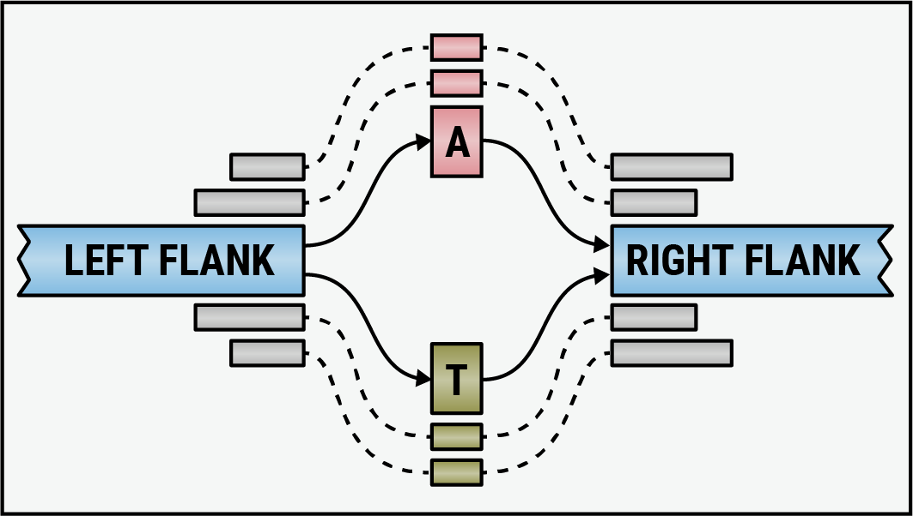
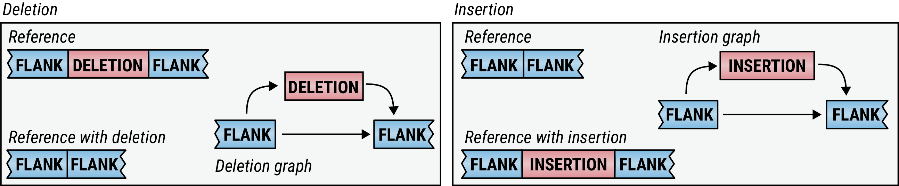
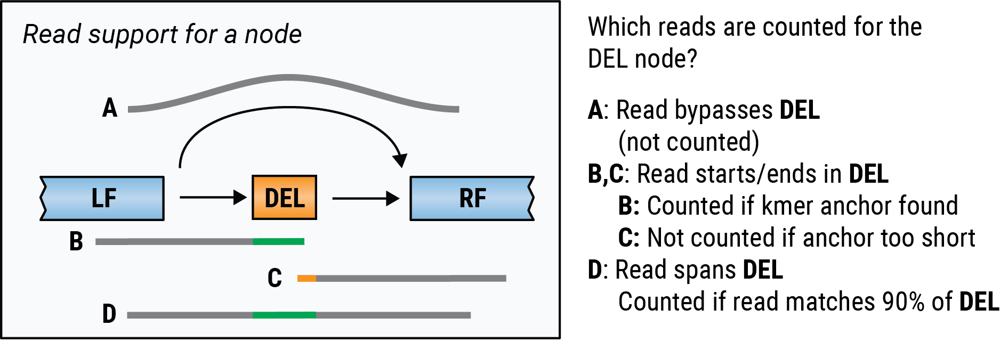
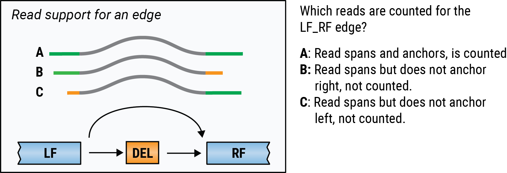
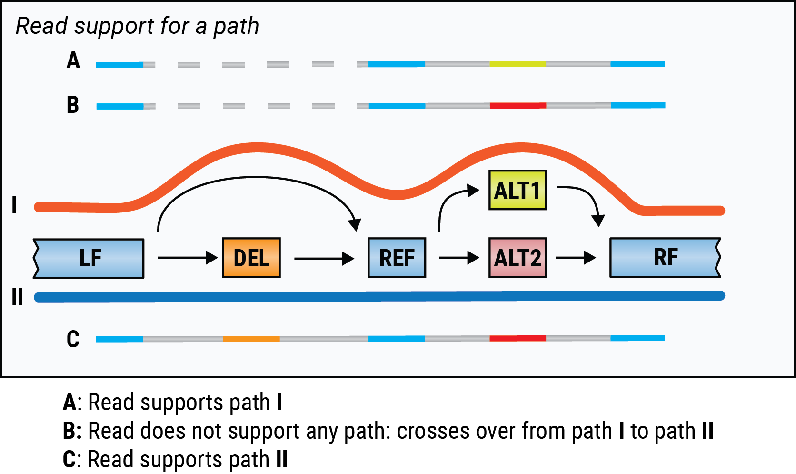
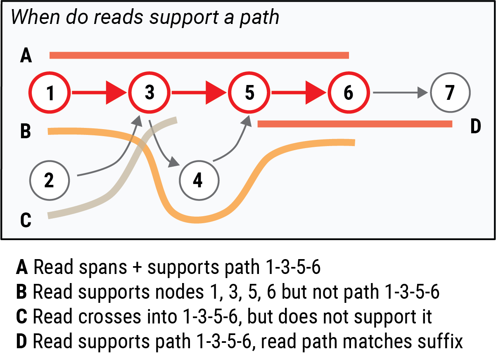

# Counting read support on graphs

<!-- vscode-markdown-toc -->
* [Introduction](#Introduction)
* [Node counting](#Nodecounting)
* [Edge counting](#Edgecounting)
* [Path counting](#Pathcounting)

<!-- vscode-markdown-toc-config
	numbering=false
	autoSave=true
	/vscode-markdown-toc-config -->
<!-- /vscode-markdown-toc -->

## Introduction

Reads mapped to a graph may support breakpoints, known small variants or haplotypes. For example, a SNP may be represented by two alternate single-basepair nodes, one for the reference nucleotide, and one for the alternate nucleotide, flanked by reference nodes left and right:

Reads supporting each of the two nodes can be used to establish which of the two SNP alleles are present in a sample. 

Similarly, a deletion can be represented by an edge that skips a piece of reference sequence:

In this document, we outline how in paragraph nodes, edges and path labels can be used to quantify read support for variants or alleles.

Let *G = (N, E)* be a **sequence graph** with node set *N = \{ n1, n2, ..., nk \}* and edge set *E = \{ (f1, t1), (f2, t2), ... , (fj, tj) \}*. Edges are directed and tuple *(f, t)* represents and edge from node *nf* to node  *nt*. Each node *ni* has an associated sequence *S(i)*, and we assume that there are no cycles in *G*. 

We define a **node path** as a sequence *\{ p1, p2, ... pl \}*, where the set of path nodes *\{ np1, np2, ..., npl \} &sub; N* where no node occurs twice (i.e. *ps &ne;pt* if *s &ne; t*), and all path edges *\{ (p1, p2), (p2, p3), ..., (pl-1, pl) \} &sub; E*. A **path** is a tuple *(q, r, P)* where *P* is a node path, *q* is a starting position in the sequence of the first node in *P* and *r* is an end position in the last node in *P*. When we don't specify *q* and *r* we implicitly assume that *q = 1* and *r = |npl|* (i.e. the first node and the last node of the path are fully contained in the path).

Each read we align to a graph is assigned a single alignment path. Variants can be represented by single nodes or edges. Haplotypes can be represented either using single paths, or a set of multiple paths (a path family). In the following sections we discuss how support for nodes, edges, and paths may be quantified given a set of read alignment paths.

## Node counting

A read supports a node if its alignment overlaps the node with a minimum number of bases (typically 16 or the length of the node, whichever is smaller).

Another thing we consider when deciding whether a read supports a node is base-identity: a read needs to have 90% of its bases mapped to a node match the node reference sequence in order to be counted in support of this node. The most extreme scenario would be a SNP node, where reads will only be counted if they match the SNP itself (due to the min(node length, 16bp) anchoring requirement).

## Edge counting

A read supports an edge if its alignment path contains the edge and anchors on both sides with a minimum number of bases.

## Path counting

Let *P* be a path in our graph.

A read supports a path *P* in the graph if one of the following conditions are met:

* the alignment path *Q* of the read fully contains path *P*,
* path *P* fully containst the alignment path *Q*,
* a suffix of *P* matches a prefix of *Q*,
* a prefix of *P* matches a suffix of *Q*.

Here are some examples:

## Path Families

A specific haplotype can be represented by a single path. However often we may be interested in grouping all haplotyes that contain certain alleles, without restricting the allele at other variants. As an example when working with a gene and pseudogene pair we may want to count any read with the gene disrupting variants towards the pseudogene, regardless of other variants modeled in the graph. 

If enumerating all paths to be grouped explicitly becomes impractical, we can define an implicit set of paths, called a path family, *F* as a set of edges *\{ f1, f2, ... fl \}*. A path *P* is in the path family *F* iff at at least one node in *P* has an edge in *F* and for any node *pn* in *P*

* No incoming edge into *pn* exists in *F* **or** *n == 0* **or** edge *(pn-1, pn)* is in *F*.
* No outgoing edge from *pn* exists in *F* **or** * *n == |P|* 
  (Number of nodes in *P*) **or** edge *(pn, pn+1)* is in *F*.

I.e. informally, if a node has incoming or outgoing edges in *F*, then a path including the node must use one of those edges to belong to the part family. A path does not have to cover the entire path family (either all nodes or all edges), but may start in the middle or enter/exit through any edge into a node that has no incoming/outgoing edges in *F*.

One way to represent a group of haplotypes with a path family is for *F* to contain the union of all the edges from the path corresponding to each haplotype.

### Path Family counting

A read is counted as consistent with a path family if the alignment path is in the path family. Hence a read can be consistent with several path families. To quantify specific support for a path family, we need to count reads that support only this path family and not other (e.g. only the pseudogene path family, not the gene). To this end paragraph reports the number of reads consistent with each subset of families defined on the graph. E.g. for a graph with two families *F1* and *F2*, it will report three counts, for  *{F1, F2}*, *F1* and  *F2*.

### Implementation options
Path families can be stored in the graph by tagging the edges with the ID all path families they are a part of. Path family counting can be implemented either by counting each read alignment path directly towards the subset of path families it matches.

### Possible Extensions
- Local loops could be supported by annotating an edge within *F* with a range of times it has to appear in *P'*. 

