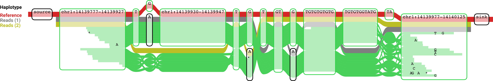

# Read-based phasing

Short-range haplotype phasing on a graph can be implemented by evaluating the read and fragment evidence linking positions on a graph directly or indirectly. Evidence of direct linkage between two positions is present if the two positions are part of the same confident read (fragment) alignment. Indirect / inferred linkage evidence can come from assertions about overlapping read alignment paths and fragment depths. In this document we describe a method for obtaining direct phasing evidence, and discuss how this could be extended to indirect evidence and infered haplotypes.

## Representing phasing information as haplotypes

We would like to extract phasing information between alleles present in the graph from aligned reads (and pairs). Phasing information can be represented as (partially) reconstructed haplotypes, i.e. a set of paths (path families) that each link alleles present on a single haplotype of the sample. If not all variants can be phased, a single haplotype will correspond to multiple paths. The number of fragments (reads / pairs) uniquely supporting a path family represents the phasing evidence.

Below we show an example of a graph alignment where reads support two distinct non-reference haplotypes:



In our approach, only variants / alleles present in the graph itself (as nodes and edges) are considered. However, novel variants found within a node may be added to the graph explicitly first. This step does not make any assumptions about the number of haplotypes in the sample or use allele frequencies to infer phasing.

## A method for reconstructing read-supported haplotypes

**Preprocessing:**
- Get alignment paths for all reads
- Merge overlapping paths from mates (read pairs)
    - Filter pairs with incompatible paths, i.e. paths which share some sequence on the graph but cannot be merged, or paths which cannot be connected through an additional valid path.

**Summarize phasing evidence:**
- For each fragments, convert the (merged) alignment paths for a path family
    - I.e. all covered edges
- Aggregate fragments resulting in identical path families, keeping track of the number of reads
- Output *Phase-families*
    - Set of path families with an associated fragment-count
        - The path family describes a set of edges occuring together on individual fragments
            - Representing phased variants
        - The fragment-count gives the number of alignments this phasing was observed on
    - This result is output to the user and can be used as input for haplotype inference and indirect phasing.

**Obtain possible haplotype paths:**
Starting from the collapsed path families above, this procedure may be used for haplotype reconstruction in the paralog use-case:
```
    G: graph in topological sort order
    F = set() # set of haplotype path families being constructed here
    for node in G:
        # 1. Extend existing path families
        for f in F:
           extending_paths = set of phase-families overlapping and compatible with f and no other f' in F
           for e in outEdges(node):
               out_count = total fragment count of extending_paths supporting edge e
               if out_count > threshold:
                   F.add(f + e) # path family f extended with edge e

        # 2. Add new path families that start at the current node
        starting_paths = phase-families starting at node
        for e in outEdges(node):
           out_count = total fragment count of starting_paths supporting edge e
           if out_count > threshold:
               F.add([e]) # new path with edge e
    # 3. Remove reduncant paths
    for f1 in F:
        for f2 in F:
            if f1 != f2 and f1 containedIn f2:
                # Could add some heuristics around supporting fragments here
                # To avoid removing a well-supported smaller path family due to a
                # single spurious extension
                F.remove(f1)

```

- For each path family in F count the number of fragments (read-pairs) uniquely supporting it
    - Report number of reads not consistent with any path family (and inconsistent pairs) as QC metrics
